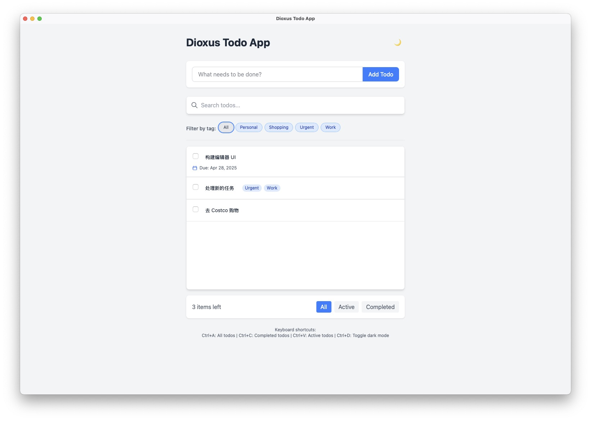

# Dioxus Todo App

A feature-rich Todo application built with Dioxus, a React-like framework for Rust.



## Features

- Add, edit, and delete todo items
- Mark todos as completed with a checkbox
- Filter todos by All, Active, or Completed status
- Persistent storage using localStorage (web) or SQLite (desktop)
- Clean, responsive UI with Tailwind CSS
- Cross-platform support (web, desktop, mobile)

## Project Structure

```
project/
├─ assets/            # Static assets
├─ memory_bank/       # Project documentation and task tracking
├─ src/
│  ├─ components/     # UI components
│  │  ├─ todo_app.rs  # Main app component
│  │  ├─ todo_form.rs # Component for adding todos
│  │  ├─ todo_list.rs # Component for displaying todos
│  │  ├─ todo_item.rs # Individual todo component
│  │  ├─ filter_bar.rs # Filter controls component
│  ├─ models/         # Data structures
│  │  ├─ todo.rs      # Todo and TodoList models
│  ├─ utils/          # Helper utilities
│  │  ├─ storage.rs   # LocalStorage/SQLite persistence
│  ├─ main.rs         # Application entry point
│  ├─ lib.rs          # Library exports for tests
├─ tests/             # Test files
├─ Cargo.toml         # Dependencies and build config
├─ input.css          # Tailwind CSS input
├─ tailwind.config.js # Tailwind configuration
```

## Development

### Prerequisites

1. Install Rust: https://www.rust-lang.org/tools/install
2. Install npm: https://docs.npmjs.com/downloading-and-installing-node-js-and-npm
3. Install the Tailwind CSS CLI: https://tailwindcss.com/docs/installation
4. Install Dioxus CLI: `cargo install dioxus-cli`

### Tailwind CSS

Run the following command to start the Tailwind CSS compiler in watch mode:

```bash
npx tailwindcss -i ./input.css -o ./assets/tailwind.css --watch
```

### Serving the App

Run the following command to start developing with the default platform:

```bash
dx serve
```

To run for a different platform, use the `--platform` flag:

```bash
dx serve --platform web     # For web
dx serve --platform desktop # For desktop
dx serve --platform mobile  # For mobile
```

### Building for Production

```bash
dx build --release
```

### Running Tests

```bash
cargo test
```

## Testing Implementation

The application includes comprehensive tests for the core functionality:

- **Model Tests**: Verify the behavior of the Todo data structures and operations
- **Storage Tests**: Ensure proper functionality of the persistence layer

The tests cover:
- Todo creation and manipulation
- TodoList operations (add, delete, toggle, update)
- Filter functionality
- Persistence with localStorage/SQLite

## License

MIT
